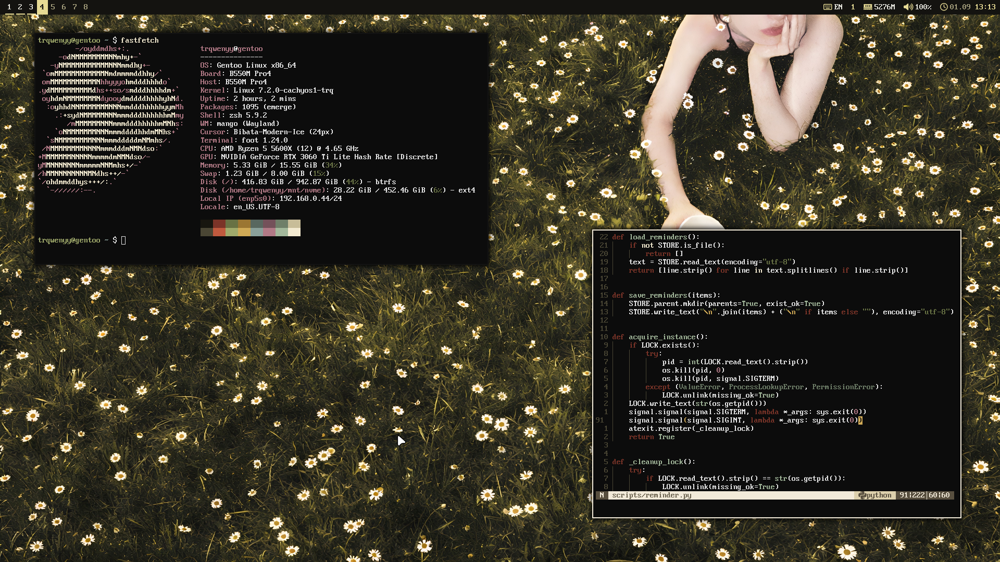

# Mango Dotfiles

Personal [MangoWM](https://github.com/mangowm/mango) dotfiles for Gentoo GNU/Linux.



## Quick Install

```sh
git clone https://github.com/fxmfxmfx/mango-dotfiles.git
cd mango-dotfiles
./scripts/check-deps.sh
./scripts/install.sh --dry-run
# If your primary output is not DP-1, apply the sed example in docs/customize.md.
# Edit .config/mango/conf.d/00-monitors.conf if your monitor layout differs.
./scripts/install.sh
```

This repo mirrors `$HOME` for dot directories such as `.config` and `.local`.
The installer backs up overwritten files by default and asks whether to install
the Graphite GTK theme and Goldy icon theme. The dry run shows what would be
copied and whether optional theme/icon installs would use local sources or clone
their upstream repositories.

Run Mango from a TTY with:

```sh
~/.local/bin/start-mango.sh
```

The setup is intentionally not distro-neutral. It assumes MangoWM, GNU userland,
Wayland tooling and a POSIX-compatible shell.

## Contents

- `.config/mango` - MangoWM session, monitor rules, key binds and autostart
- `.config/rs-yambar` - top bar with Mango workspace and keyboard-layout scripts
- `.config/foot`, `.config/rofi`, `.config/dunst` - terminal, launcher and notifications
- `.config/nvim` - Neovim config using lazy.nvim (minimal on purpose)
- `scripts` - helper scripts for screenshots, clipboard, layout, portals,
  wallpaper, emoji picker and more
- `Wallpaper` - wallpapers used by the wallpaper picker
- `docs` - package list and customization notes for forks

## Compatibility Notes

- Monitor config is machine-specific: `DP-1` at `1920x1080@170` and `HDMI-A-1`
  at `1920x1080@60`. Edit `.config/mango/conf.d/00-monitors.conf` before using
  this on another machine. See Mango's monitor docs:
  [mangowm.github.io/docs/configuration/monitors](https://mangowm.github.io/docs/configuration/monitors).
- [rs-yambar](https://github.com/fxmfxmfx/rs-yambar) is pinned to `DP-1` in
  `.config/rs-yambar/config.toml`. The workspace script can read
  `YAMBAR_MANGO_OUTPUT`, but the bar config and click actions still need edits
  if your output has another name.
- `layout.sh` defaults to `DP-1`; override with `MANGO_OUTPUT=...` if needed.
- Wallpaper picker reads images from `~/Wallpaper` by default. Override with
  `WALLPAPER_DIR=/path/to/wallpapers`.
- Portal autostart uses `.local/bin/start-portals.sh`, which starts the main,
  GTK and wlr portal binaries after checking normal `$PATH` lookup and common
  backend locations.
- See `docs/customize.md` for the files that usually need local edits.

## Dependencies

Run the checker first:

```sh
./scripts/check-deps.sh
```

It is the source of truth for this setup. If it reports everything you need as
`ok`, you usually do not need to audit this list by hand. The list below is here
mainly so missing tools have links and are easier to install.

Portal checks are split on purpose:

- Gentoo: portal binaries commonly live under `/usr/libexec`, so the checker
  reports those paths separately.
- Most other distros: portal binaries are usually found through `$PATH` or under
  `/usr/lib`.

The important part is that each portal has at least one `ok` line. `notfound` for
a Gentoo-only path is fine on a non-Gentoo system, and the reverse is fine on
Gentoo.

### Mango Session

- [`mango`](https://github.com/mangowm/mango)
- `dbus`
- `dbus-run-session`
- `pipewire`
- `pipewire-pulse`
- `wireplumber`
- `xdg-desktop-portal`
- `xdg-desktop-portal-wlr`
- `xdg-desktop-portal-gtk`
- [`foot`](https://github.com/DanteAlighierin/foot)
- [`rofi`](https://github.com/DaveDavenport/rofi)
- [`awww`](https://github.com/NotAShelf/awww)
- [`rs-yambar`](https://github.com/fxmfxmfx/rs-yambar)
- [`dunst`](https://github.com/dunst-project/dunst)

### Script Dependencies

These are mostly command-line tools used by helper scripts. Prefer
`./scripts/check-deps.sh` over manually reading this section.

- `bash`
- GNU `coreutils`
- `findutils`
- `gawk` or compatible `awk`
- `grep`
- `sed`
- `head`
- `procps`/`psmisc` tools such as `pgrep` and `killall`
- [`wl-clipboard`](https://github.com/bugaevc/wl-clipboard)
- [`cliphist`](https://github.com/sentriz/cliphist)
- [`wayfreeze`](https://github.com/Jappie3/wayfreeze)
- [`grim`](https://gitlab.freedesktop.org/emersion/grim)
- [`slurp`](https://github.com/emersion/slurp)
- [`swappy`](https://github.com/jtheoof/swappy)

### Optional Apps And Tools

- `mpv`
- `imv`
- `thunar`
- `librewolf`
- `pavucontrol`

### Shell And Editor

- `zsh`
- `nvim`
- `git`
- `make`
- `gcc` or another C compiler for Treesitter parsers
- `python`
- `btop`
- `fastfetch`
- [`ripgrep`](https://github.com/BurntSushi/ripgrep)
- [`fd`](https://github.com/sharkdp/fd)
- [`eza`](https://github.com/eza-community/eza)
- [`bat`](https://github.com/sharkdp/bat)
- [`dust`](https://github.com/bootandy/dust)
- `doas`
- [`tty-clock`](https://github.com/xorg62/tty-clock)
- [`neo`](https://github.com/st3w/neo)

### UI And Themes

- [`DejaVu Sans`](https://dejavu-fonts.github.io/)
- [`DejaVu Sans Mono`](https://dejavu-fonts.github.io/)
- [`Symbols Nerd Font Mono`](https://www.nerdfonts.com/)
- [`Graphite-Dark`](https://github.com/vinceliuice/Graphite-gtk-theme)
- [`Goldy-Dark-Icons`](https://github.com/L4ki/Goldy-Plasma-Themes/tree/main/Goldy%20Icons%20Themes/Goldy-Dark-Icons)

For a more readable package list, see `docs/packages.md`.

## Key Binds

- `Super+Return` - terminal
- `Super+Esc` - launcher
- `Super+W` - browser
- `Super+E` - file manager
- `Super+V` - clipboard history
- `Super+X` - wallpaper picker
- `Super+/` - emoji picker
- `Print` - monitor screenshot to clipboard
- `Ctrl+Print` - full screenshot to clipboard
- `Super+Shift+S` - area screenshot to clipboard
- `Super+Shift+D` - area screenshot through Swappy
