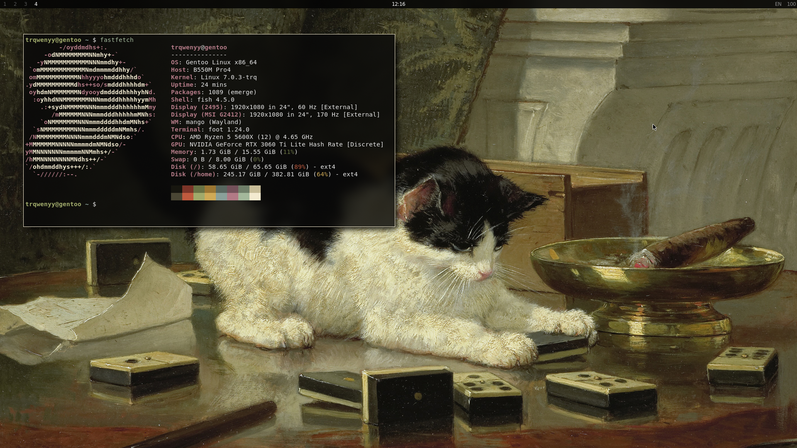

# Mango Dotfiles

Personal [MangoWM](https://github.com/mangowm/mango) dotfiles for Gentoo GNU/Linux.



## Quick Install

```sh
git clone https://github.com/fxmfxmfx/mango-dotfiles.git
cd mango-dotfiles
./scripts/check-deps.sh
./scripts/install.sh --dry-run
./scripts/install.sh
```

The setup is intentionally not distro-neutral. It assumes MangoWM, GNU userland,
Wayland tooling, `fish` as the interactive shell, and xdg-desktop-portal binaries
in `/usr/libexec`.

## Contents

- `.config/mango` - MangoWM session, monitor rules, key binds and autostart
- `.config/yambar` - top bar with Mango workspace and keyboard-layout scripts
- `.config/foot`, `.config/fuzzel`, `.config/dunst` - terminal, launcher and notifications
- `.config/nvim` - Neovim config using lazy.nvim and pinned plugin lockfile
- `.config/fish` - shell aliases and colors
- `.local/bin` - helper scripts for screenshots, clipboard, layout, wallpaper and emoji picker
- `Wallpaper` - wallpapers used by the wallpaper picker
- `docs` - package list and customization notes for forks
- `screenshots` - some screenshots

## Compatibility Notes

- Monitor config is machine-specific: `DP-1` at `1920x1080@170` and `HDMI-A-1`
  at `1920x1080@60`. Edit `.config/mango/conf.d/00-monitors.conf` before using
  this on another machine.
- Yambar is pinned to `DP-1` in `.config/yambar/config.yml`. The workspace script
  can read `YAMBAR_MANGO_OUTPUT`, but the bar config and click actions still need
  edits if your output has another name.
- `layout.sh` defaults to `DP-1`; override with `MANGO_OUTPUT=...` if needed.
- Wallpaper picker reads images from `~/Wallpaper` by default. Override with
  `WALLPAPER_DIR=/path/to/wallpapers`.
- Portal autostart uses Gentoo's `/usr/libexec/xdg-desktop-portal-wlr` path.
  Other distros may place portal backends elsewhere.
- Neovim bootstraps lazy.nvim from GitHub on first launch and Treesitter parsers
  may need a C toolchain.
- Fish aliases and functions assume the shell-experience tools listed below
  (`eza`, `bat`, `rg`, `fd`, `dust`, `btop`, `fastfetch`, `doas`, `tty-clock`,
  etc.). Install them first or edit `.config/fish/config.fish` and
  `.config/fish/functions` before using this setup.
- See `docs/customize.md` for the files that usually need local edits.

## Dependencies

### Mango Session

- `mango`
- `dbus`
- `pipewire`
- `pipewire-pulse`
- `wireplumber`
- `xdg-desktop-portal`
- `xdg-desktop-portal-wlr`
- `xdg-desktop-portal-gtk`
- `foot`
- `fuzzel`
- `awww`
- `yambar`
- `dunst`
- `xsettingsd`

### Script Dependencies

- `bash`
- GNU `coreutils`
- `findutils`
- `gawk` or compatible `awk`
- `grep`
- `sed`
- `procps`/`psmisc` tools such as `pgrep` and `killall`
- `wl-clipboard`
- `cliphist`
- `wayfreeze`
- `grim`
- `slurp`
- `swappy`
- `curl`
- `jq`
- `socat`

### Daily Apps

- `mpv`
- `imv`
- `thunar`
- `librewolf`
- `pavucontrol`

### Shell And Editor

- `fish`
- `fisher`
- `neovim`
- `git`
- `make`
- `gcc` or another C compiler for Treesitter parsers
- `btop`
- `fastfetch`
- `ripgrep`
- `fd`
- `eza`
- `bat`
- `dust`
- `doas`
- `tty-clock`

### UI And Themes

- `DejaVu Sans`
- `DejaVu Sans Mono`
- `Symbols Nerd Font Mono`
- `Colloid-Dark`
- `Goldy-Dark-Icons`

## Install

This repo mirrors `$HOME` for dot directories such as `.config` and `.local`.
Review the files first, then run a dry run:

```sh
./scripts/install.sh --dry-run
```

Install with backups for overwritten files:

```sh
./scripts/install.sh
```

If `~/Colloid-gtk-theme/install.sh` exists, the installer also applies the
Colloid GTK theme with `--tweaks black rimless`. Use `--no-theme` to skip that
step.

Run Mango from a TTY with:

```sh
~/.local/bin/start-mango.sh
```

## Dependency Check

Run:

```sh
./scripts/check-deps.sh
```

The script checks required commands plus the Gentoo `/usr/libexec` portal paths.
Optional daily applications are reported too, but the core session can still start
without some of them.

For a more readable package list, see `docs/packages.md`.

## Key Binds

- `Super+Return` - terminal
- `Super+Esc` - launcher
- `Super+W` - browser
- `Super+E` - file manager
- `Super+V` - clipboard history
- `Super+X` - wallpaper picker
- `Super+/` - emoji picker
- `Print` - monitor screenshot to clipboard
- `Ctrl+Print` - full screenshot to clipboard
- `Super+Shift+S` - area screenshot to clipboard
- `Super+Shift+D` - area screenshot through Swappy

## Before Sharing Forks

- Add screenshots to `screenshots/`.
- Remove private machine-specific monitor, wallpaper, app and theme assumptions.
- Do not commit generated state such as shell variables, Neovim plugin directories,
  caches, logs or local histories.
- Keep `lazy-lock.json` committed if you want reproducible Neovim plugin versions.

## License

MIT. See `LICENSE`.
